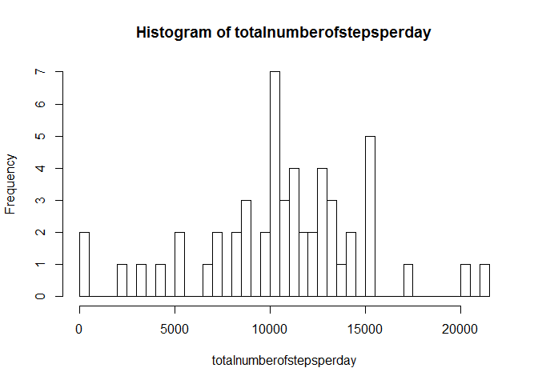

# Reproducible Research: Peer Assessment 1


## Loading and preprocessing the data
##### The activity.zip file has already been unpacked via the git cml


```r
# Loading the data
# Retrieve data and store in a dataframe called datafile

setwd("C:/Users/evdmaaten/Documents/GitHub/RepData_PeerAssessment1/activity")
datafile <- read.csv("activity.csv")

# Preprocessing the data
# Remove incomplete observations from datafile

datafile <- datafile[complete.cases(datafile),]
```

## What is mean total number of steps taken per day?


```r
totalnumberofstepsperday <- tapply(datafile$steps, datafile$date, sum, na.rm=TRUE)
totalnumberofstepsperday <- totalnumberofstepsperday[complete.cases(totalnumberofstepsperday)]
hist(totalnumberofstepsperday, breaks = 40,)
```

 

```r
mean(totalnumberofstepsperday)
```

```
## [1] 10766.19
```

```r
median(totalnumberofstepsperday)
```

```
## [1] 10765
```

## What is the average daily activity pattern?


## Imputing missing values


## Are there differences in activity patterns between weekdays and weekends?
