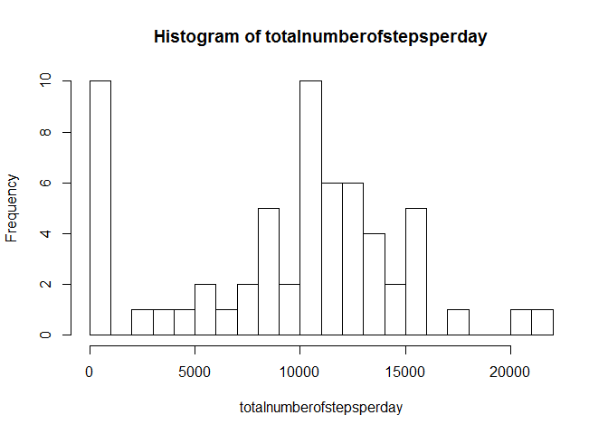

# Reproducible Research: Peer Assessment 1


## Loading and preprocessing the data  
##### The activity.zip file has already been unpacked via the git cml


```r
# Loading the data
# Retrieve data and store in a dataframe called datafile

setwd("C:/Users/evdmaaten/Documents/GitHub/RepData_PeerAssessment1/activity")
datafile <- read.csv("activity.csv")

# Preprocessing the data
# Remove incomplete observations from datafile

#datafile <- datafile[complete.cases(datafile),]
```

## What is mean total number of steps taken per day?


```r
# Create a dataframe with the total number of steps per day

totalnumberofstepsperday <- tapply(datafile$steps, datafile$date, sum, na.rm=TRUE)
totalnumberofstepsperday <- totalnumberofstepsperday[complete.cases(totalnumberofstepsperday)]

# Create a histogram of the dataframe with the total number of steps per day

hist(totalnumberofstepsperday, breaks = 20,)
```

 

```r
# Calculate the mean number of steps per day

mean(totalnumberofstepsperday, na.rm=TRUE)
```

```
## [1] 9354.23
```

```r
# Calculate the median number of steps per day

median(totalnumberofstepsperday, na.rm=TRUE)
```

```
## [1] 10395
```

## What is the average daily activity pattern?

##### Make a time series plot (i.e. type = "l") of the 5-minute interval (x-axis) and the average number of steps taken, averaged across all days (y-axis)

```r
# Create a dataframe with the mean steps for each five minute interval.
FiveMinuteIntervals <- tapply(datafile$steps, datafile$interval, mean, na.rm = TRUE)
plot(FiveMinuteIntervals, type = "l")
```

 

##### Which 5-minute interval, on average across all the days in the dataset, contains the maximum number of steps?

```r
which.max(FiveMinuteIntervals)
```

```
## 835 
## 104
```

##### It turns out two 5-minute intervals contain the maximum number of steps

## Imputing missing values

##### Calculate and report the total number of missing values in the dataset (i.e. the total number of rows with NAs)

```r
sum(is.na(datafile))
```

```
## [1] 2304
```


## Are there differences in activity patterns between weekdays and weekends?
